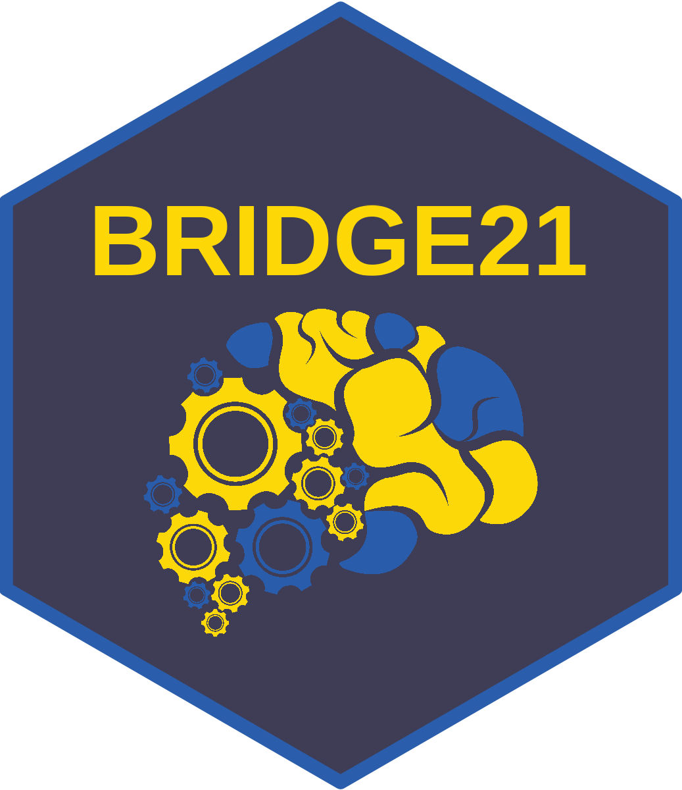
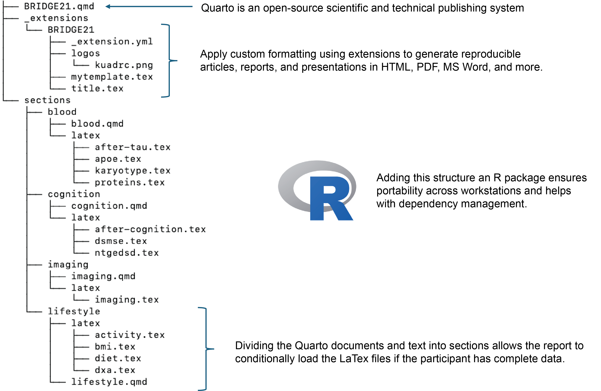

# BRIDGE21 

The Building Reports and Insights for Down syndrome Guidance and Empowerment
(BRIDGE21) R package is focused on automating participant feedback reports for
Down syndrome cohort studies. It generates participant feedback reports and
insights for research participants to help get the data back into the hands of
the participants and their families.

## Package Structure



## Hex Sticker

```r
# To reproduce hex sticker after package is installed
# Change filename if you want to save it in a different location

hexSticker::sticker(
  system.file("images/brain.png", package = "BRIDGE21"),
  package = "BRIDGE21",
  p_size = 40,
  s_x = 1,
  s_y = 0.8,
  s_width = 0.5,
  filename = "man/figures/bridge21.png",
  h_color = "#2a5dab",
  h_fill = "#3E3D55",
  p_color = "#fed707",
  p_family = "sans",
  p_fontface = "bold",
  dpi = 600
)


```
