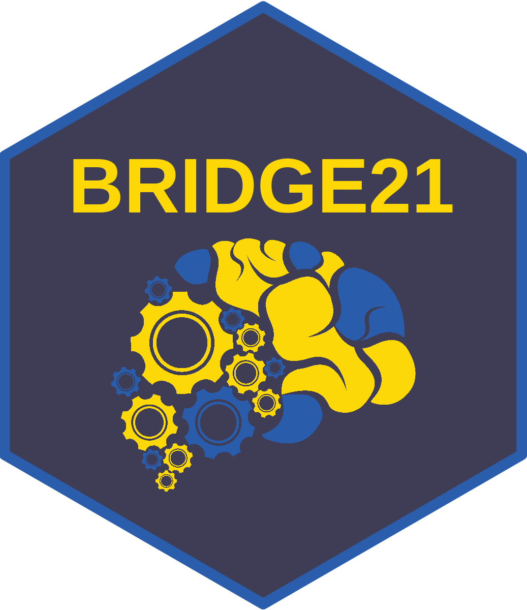
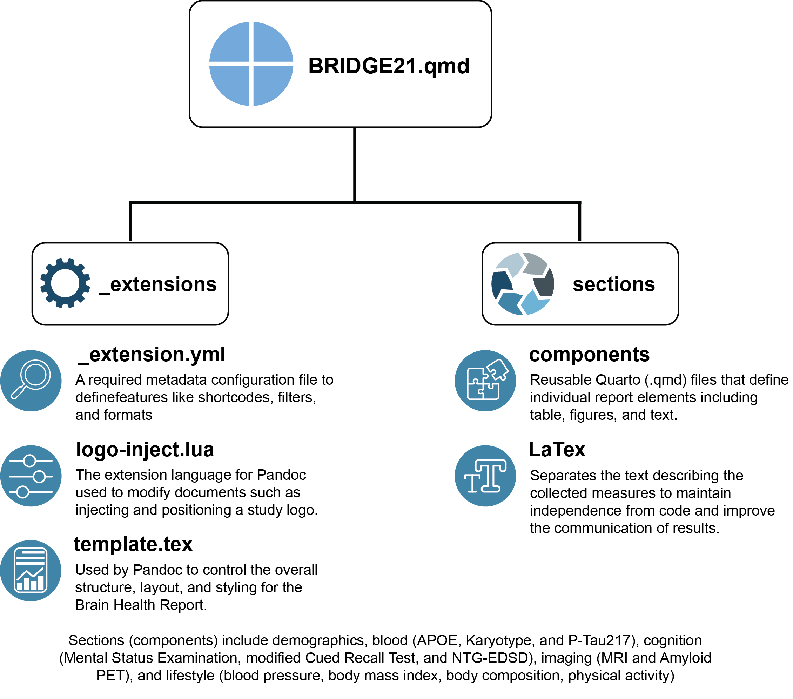

# BRIDGE21 

The **Building Reports and Insights for Down syndrome Guidance and Empowerment**
(BRIDGE21) R package automates the creation of individualized participant
feedback reports for research studies involving adults with Down syndrome,
particularly in brain health and Alzheimer’s disease research. BRIDGE21
generates disclosure-ready PDF reports that return research findings to
participants and their families in a format that is accurate, accessible, and
appropriately cautious about the limitations and interpretation of research
results.

## Supported Studies

BRIDGE21 currently supports report generation for four Down syndrome brain
health cohorts:

- **KU ADRC DS Cohort** — KU Alzheimer's Disease Research Center Brain Health
  and Down Syndrome Program
- **BOLD** — Brain Outcomes and Lifestyle in Down syndrome Study
- **TRC-DS** — Trial Ready Cohort - Down syndrome Study
- **ABC-DS** — Alzheimer's Biomarker Consortium – Down syndrome Study

Each study has its own logo, branding, and variable naming conventions, which
`generate_report()` detects and applies automatically based on the reports
requested.

## Report Sections

Reports are built from a set of modular Quarto (`.qmd`) sections located in
`inst/qmd/sections/`, which are included in the main `BRIDGE21.qmd` template:

| Section      | Contents                                                                                              |
| ------------ | ----------------------------------------------------------------------------------------------------- |
| Demographics | Participant identifying and visit information                                                         |
| Cognition    | DSMSE, NTG-EDSD, Modified Cued Recall Test, Vineland Adaptive Behavior Scale                          |
| Imaging      | MRI and PET (including amyloid/centiloid or high/not-high classification)                             |
| Blood        | APOE genotype, karyotype, metabolism (lipid/glucose) panels, plasma p-tau217                          |
| Lifestyle    | Physical activity (accelerometer), blood pressure, BMI, body composition (DXA), and VeggieMeter score |

A "Super Six" brain health infographic and, for KU ADRC/BOLD participants, a
resources section are appended to the end of each report. Since not every
measure is collected by every study, sections and sub-components render
conditionally based on which variables are present in the participant's data.

## Installation

BRIDGE21 depends on the internal `kuadrc.xnat` package for retrieving MRI
images from XNAT:

```r
# install.packages("remotes")
remotes::install_github("bhelsel/kuadrc.xnat")
remotes::install_github("bhelsel/BRIDGE21")
```

## Usage

The primary entry point is `generate_report()`, which takes a participant ID,
a data file, and an output directory, and renders a PDF report:

```r
library(BRIDGE21)

generate_report(
  kuadrc_demographics, kuadrc_cognition, kuadrc_mri, kuadrc_pet,
  id = "12345",
  datafile = "data/kuadrc_data.csv",
  outputdir = "reports/",
  acceldir = "data/accelerometer/"  # optional, raw .gt3x files
)
```

Reports are passed as unquoted, study-prefixed names (e.g. `kuadrc_blood`,
`bold_cognition`, `abcds_lifestyle`, `trcds_pet`) for any combination of
sections belonging to a single study, or by only the prefix (e.g., `kuadrc`) to
generate every available section for that study. Setting `example_report = TRUE`
generates a sample report using bundled example data, which is useful for
previewing report layout and formatting without real participant data:

```r
generate_report(id = "TestJayhawk", outputdir = "reports/", example_report = TRUE)
```

## Package Structure


